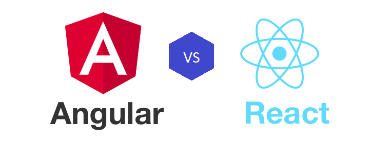

{ style="display: block; margin: 0 auto" }
# Angular vs React.JS
---
### Angular
Angular is a TypeScript based Web development framework for Single Page Applications. Angular is an open-source web framework maintained by **Google**. Initialy Google came with a library for developing Single Page Applications called AngularJS. Later, the same team worked on a different project that released as a development framework for SPA applications. It is named as Angular. Angular JS uses JavaScript to develop web UI applications. But, Angular uses TypeScript to develop SPA applications that helps developers to create type-safe and ES6 based JavaScript applications. 
Angular is a web UI development framework not a library. A libary offers just a collection of functions that can be called from any web application.
#### Angular offers the following features:
1) **Angular CLI**  
    Angular providers a command line tool to create, test, run and build project. This CLI tool provides a rich set of commands that can also be used to generate your Angular components, services, directives, pipes, modules, classes and more. Use the CLI command to run the project in watch mode during development. You can also run the test files using CLI command. A single CLI command can also produce code that can be deployed in your web server.
2) **Open-source and cross-platform development**  
    Angular is an open-source web framework for developing Single Page Applications. It provides cross-platform support, so you can develop your web application from and OS using your favorite IDEs such as VS code, Atom, JetBrains WebStorm, NetBeans, IntelliJ IDEA etc.
3) **MVC or MVVM Architecture**  
    MVC refers to Model-View-Controller and MVVM refers to Model-View-ViewModel. You can develop you application in MVC or MVVM architecture using Angular. Angular allows you to create reusable components. A component provides and HTML view and code file. The code file contains the event handling code and other functions. The HTML file contains the markup and Angular directives and pipes. You can also create injectable services for reusable code logic.
4) **Performance and fast view rendering**  
    Next version of Angular framework will come with a new compilation and rendering engine. This next generation rendering engine is named as **Ivy**.  With the version 9 release of Angular, the new compiler and runtime instructions are used by default instead of the older compiler and runtime, known as View Engine.
5) **TypeScript for development**  
    Angular uses **TypeScript** as the default language for development. It helps developers to use the ES6 features in your application. TypeScript is a superset of JavaScript that provides compile-time error checking. The type-safe TypeScript language increases the productivity of developers by helping them to generate error-free code.
6) **Built-in Dependency Injection (DI) support**  
    To increase the efficiency and modularity of your application you can create reusable service classes in Angular. These service classes can be injected in to any component, directive, pipe or other services using Dependency Injection. Angular uses its own DI framework to handle it. With DI application manages the number of instances, scope and life time of your service objects.
7) **Event handling and Two-way data binding support**  
    Angular offers built-in two-way data binding which helps us to bind the objects to form controls. Angular also also provides event-handling functionality that helps to invoke function on various events of the UI elements. 
8) **Built-in form validation and error handling** 
    Angular provides two ways for creating and managin forms- Template Driven and Reactive. The template driven using the *FormsModule* and directives such as *ngModel* and *ngForm*. Reactive forms uses *ReactiveFormsModule* and directives and services suchas *FormGroup*, *FormControl*, *Validators*, *FormBuilder* etc.
9) **Enahanced and simple routing**  
    Angular uses built-in routing module that uses the HTML 5 routing paths. You can use route parameters and query parameters to the routes. Angular uses the *RouterModule* to enable routing in your applciation. Angular routing also offers the following features:  
    * Lazy loading  
    * Route guards  
    * Data resolvers  
    * Http Interceptors
10) **Component Development Kit (CDK) and support for Angular Material**  
    The Component Dev Kit (CDK) is a set of tools that implement common interaction patterns whilst being unopinionated about their presentation. Angular CDK provides a feature called *Virtual Scrolling* that loads only a set of data that fits the screen. When you scroll down it loads the data dynamically and load into the page component. The latest version of Angular provides support for Material themes using Angular Material that is used as the backbone of the Angular CDK.
11) **Differential loading**    
    Angular 8 comes with a new feature called *Differential loading*. Using this Angular CLI can now generate two separate bundles of project output, one for the legacy JavaScript (ES5) and another one for modern JavaScript (ES6 and later). 

[Navigate to Angular website](https://angular.io/)  
[Navigate to Angular CLI web site](https://cli.angular.io/)
### React
ReactJS is a JavaScript library for building fast rendering User Interfaces for you web applications. ReactJS library is developed and maintained by **Facebook**. React uses *JSX* for developing the UI components.  It is declarative, open-source and cross-platform library that uses a concept called *Virtual DOM* for developing fast rendering UI elements.   

#### Features of ReactJS
1) **Open-source and cross-platform support**  
    ReactJS is developed by Facebook and it is available as an open-source library for UI developers. Since it is a small JavaScript library you can develop your application in any platform with any IDEs.
2) **CLI tool to start with quick start templates** 
    You can start creating your first React application using the *create-react-app* CLI tool. This CLI tool can generate basic template of the React application with JavaScript and TypeScript language. You can use this CLI tool to create, run and build the project with ease. Install the tool gloabally using `npm install -g create-react-app` command.
3) **Virtual DOM support**  
    React uses a concept called **Virtual DOM** for fast rendering of UI elements. Virtual DOM is an exact copy of the Browser DOM that is updated frequently based on the data changes. It is quick to update the Virtual DOM than the browser DOM since it is a memory object. 
4) **One-way data binding**  
    ReactJS is introduced as a UI development library for rendering data quickly on the web pages. For that, it used the one-way data bidning to update the data on the UI element. React does not support two-way data binding by default. But you can use the events and properties to achieve this.
4) **Easy integration with other web frameworks**
    Since it is a UI development library you can easily integrate React with any of your web frameworks such as PHP, JSP and Servlets, ASP.NET, Angular etc. You can use the CDN links or downloadable JS files in your applications.
5) **Ideal for mobile app development**  
    You can create native apps for you Android and iOS devices using the React Native. React Native is a custom renderer that runs on the React platform. It uses the native components instead of the web components. 
6) **Rich set of libraries**  
    Since React is introduced as a library for fast rendering UI components, it does not support some of the web features such as routing, form validation, centralized state management, Dependency Injection etc out of the box. But, it allows you to use a rich set of JavaScript libraries such as React Router for routing, Redux for state management, React Bootstrap for responsive web design, React From for form validations etc.
7) **Better community support**  
    ReactJS is now driven by a community and individual developers. You can contribute to the React through the community. 

[Navigate to React website](https://reactjs.org/)

### Which one to choose - React or Angular?  
One of the major question asked by developers and project managers to me about is 'Which one to choose- React or Angular?'. Every one have their own reason for choosing Angular and React for their projects. If you closely look into the capabilities of the Angular and React, you will find the solution for it. You may read about Angular and React from many blogs and forums, and you may come with an answer 'React'- because uses Virtual DOM for fast rendering of the UI elements.  

If you read the above description about Angular and React you will notice one important point that Angular is a complete framework for SPA development and React is just a library. Angular is a complete web framework for developing an end-to-end web application. It provides all the features for developing a complete web application such as routing, two-way data binding, form validation, Dependency injection, CLI tool, asynchrounous functions using Observables and promises and more. But, React is just a library like jQuery which can be easily integrated with any other web framework. It is used just to increase the speed of the view rendering.   
If you are looking for a complete web application such as HR management application, E-commerce applications, Financial applications etc you need to choose Angular. Such applciations are very large and they use multiple pages, data entry forms and reusable code logics. Angular offers built-in routing module that provides features such as  lazy loading of modules, http interceptors for reqeust and response processing, data resolvers for loading data when a route is activated, guards for conditionally activating and deactivating routes and more. It also provides built-in form handling modules control binding and validation, event handing etc. The builting DI engine helps to control the scope and lifetime of the services. 

But, if you are developing a web application which is mostly used for presenting data to users than entry forms such as Dashboards, social media applications, online newspaper websites etc then you can choose ReactJS for it. Because these kind of applications are mostly using data representation UI components than the data entry forms. React's Virtual DOM with one-way data binding helps to render the data quickly on the web pages. You can also develop end-to-end web application using React but you may need to use a large set of external libraries for state-management (Redux or Flux), routing (React router), responsive design (React Bootstrap/Material-UI) and form validation (React Form).  

I hope this will help you to understand the differences of two promising JS technologies for Web development. 

#### Author: Sonu Sathyadas  
#### Email : [sonusathyadas@hotmail.com](mailto:sonusathyadas@hotmail.com)
